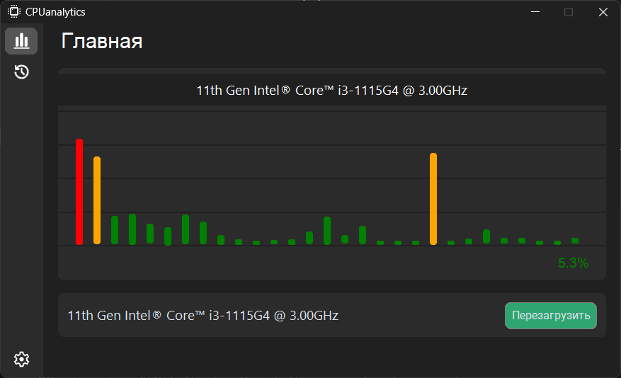
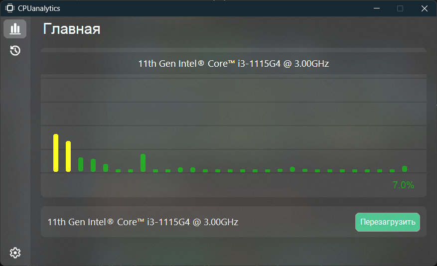

# CPUanalytics
CPUanalytics is app for monitoring and restart CPU
--------------------------------------------------
## 0.1.0
The CPUanalytics program shows CPU analytics, can reboot the processor, monitor individual processes, time since CPU startup, and other data. Through the program, you will be able to open the task manager.

## 0.1.1 (Planed)
One hundred languade, personalisation

Versions
| Version | Release date | Innovations                                             |
| ------- | ------------ | ------------------------------------------------------- |
| 0.1.0   | ~01.01.2024  | 7 language; CPU monitoring; CPU reload; Personalisation |
| 0.1.1   | None         | 100 languages; Animation menu; Optimisation             |

##### Dark Theme

##### Light Theme

##### Blur Theme

